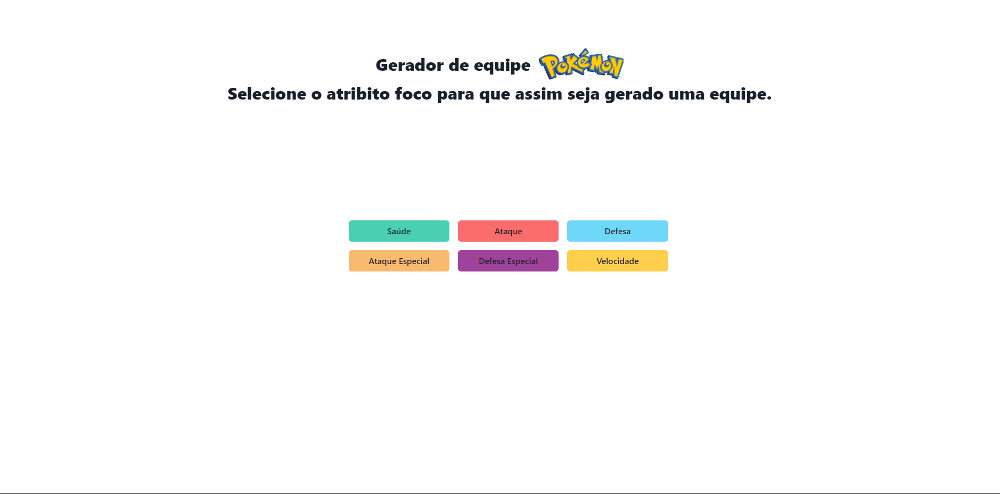
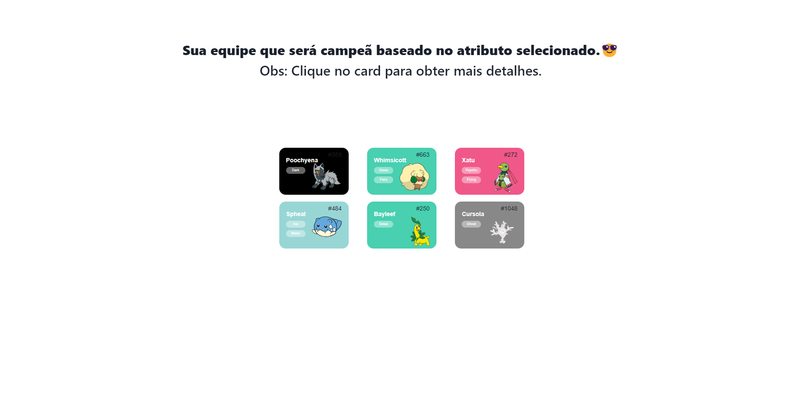
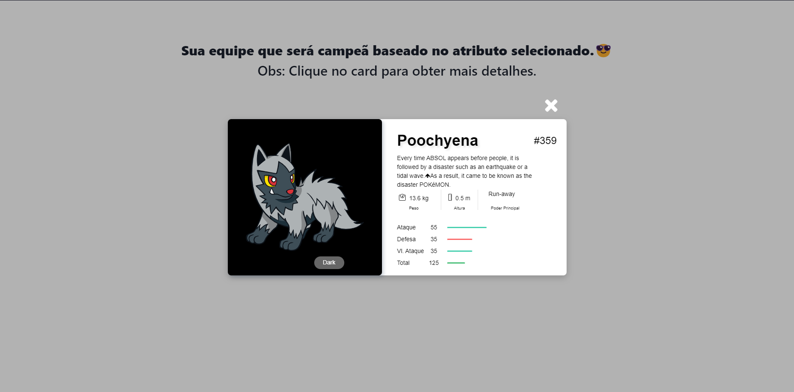
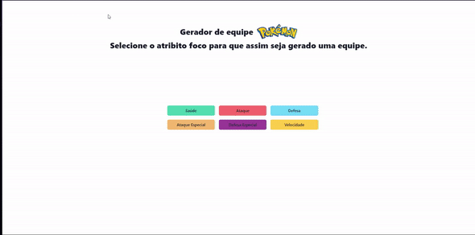

Temas:

 - Final 


# Gerador de Equipes Pokemons

## Alunos
| Matrícula | Aluno                            |
| --------- | -------------------------------- |
| 170032591 | Edvan Barreira Gomes Junior      |
| 170020525 | Pedro Henrique de Lima Malaquias |

## Sobre 
Este projeto tem como objetivo aplicar os algorítimos de Busca em largura e Knapsack. Aplicamos esses algorítimos com o contexto de gerar equipes de pokemon por meio de cenários aleatórios.

## Screenshots




## Instalação 
**Linguagem**: JavaScript<br>
**Framework**: ReactJs/Chackra UI<br>

```
git clone https://github.com/projeto-de-algoritmos/TF_DUPLA_12

cd TF_DUPLA_12

cd projectfinalpa

yarn
```


## Uso 
```
cd projectfinalpa

yarn start

```


